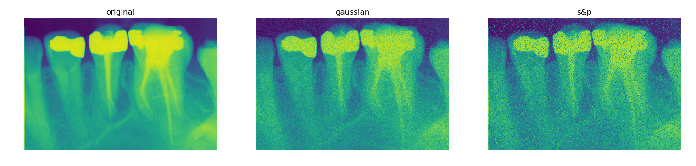

# Mediacl Image Denoising
Autoencoder pipeline  to denoise Medical Images.

# Data

# Noise Generation
### Adding gaussian and salt&pepper noise to different medical images.

# Autoencoder

# Results